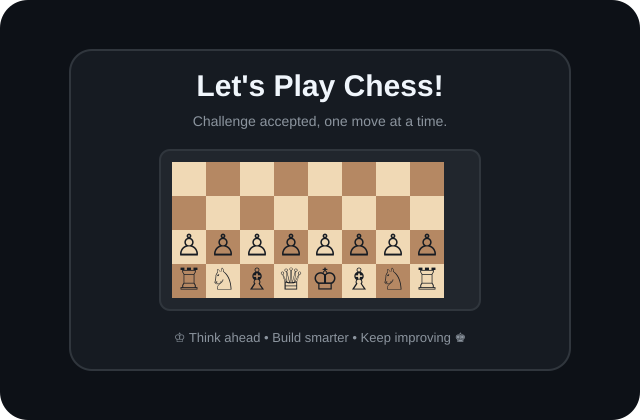

<h1 align="center">Hey there 👋, I'm Farrel</h1>

<h3 align="center">Informatics Engineering Student | Full-Stack & Mobile Developer</h3>

  I'm an engineering student with a deep interest in building robust software, from mobile applications and web interfaces to IoT integrations and self-hosted server environments. Always exploring new frameworks and pushing my technical boundaries.

###

  
  
  

---

### 💻 Tech Stack & Tools

  
  
  
  
  
  
  
  
  
  
  
  
  

---

### ♟️ Let's Play Chess!

  
   
  <strong>Click the board to play.</strong>

---

### 📊 GitHub Activity

  <picture>
    <source media="(prefers-color-scheme: dark)" srcset="https://raw.githubusercontent.com/eriksone225/eriksone225/pacman-output/pacman-contribution-graph-dark.svg">
    <source media="(prefers-color-scheme: light)" srcset="https://raw.githubusercontent.com/eriksone225/eriksone225/pacman-output/pacman-contribution-graph.svg">
    
  </picture>

 

  

 

  
  

---

### 📫 Let's Connect
* Feel free to reach out to me via [LinkedIn](https://www.linkedin.com/in/farrel-krisnanegara-b2a252220/). 
* *Note: I highly prefer text-based communication over calls!*
